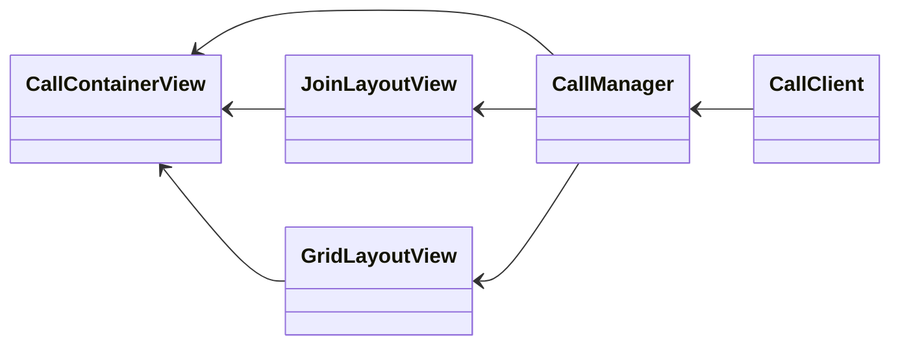

# Daily iOS Starter Kit

This starter kit is an example of how to build a basic video call app using
`SwiftUI` and the [Daily Client SDK for iOS][SDK].

[SDK]: https://docs.daily.co/reference/ios

## Prerequisites

- [Sign up for a Daily account](https://dashboard.daily.co/signup)
- [Create a Daily room URL][CreateRoom]

[CreateRoom]: https://help.daily.co/en/articles/4202139-creating-and-viewing-rooms

## How To Run

1. Install [Xcode 14.3.1](https://developer.apple.com/xcode/)
2. Sign in to Xcode with an Apple Developer account that can be used with auto-codesigning
3. Clone this repository, i.e.: `git clone git@github.com:daily-demos/daily-ios-starter-kit.git`
4. Open the `DailyStarterKit.xcodeproj` in Xcode.
5. Choose your team in the "Signing & Capabilities" section for the `DailyStarterKit` target
6. Build & Run

*note: Many views have `SwiftUI` previews set up that you can experiment with.*

## Architecture & Design

The diagram below is a simplified view of the structure of the app. The
`CallContainerView` is a full screen view that contains all other views. The
`CallManager` interacts with the Daily `CallClient`, and its primary
responsibility is transforming the state from the `CallClient` to the state
needed to render the UI.

The views in the diagram above also have a model object that is responsible for
delegating user actions to the `CallManager` and reducing any state from the
`CallManager` to only what is needed to render the UI in its owning view.
